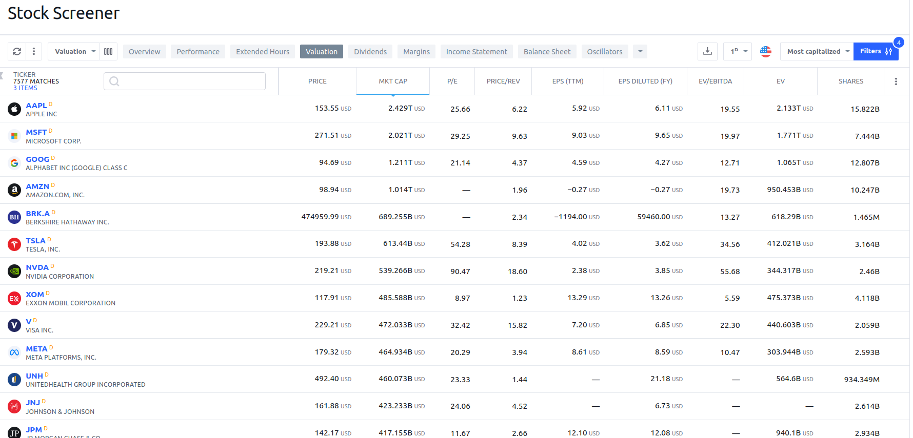

```{css, echo=FALSE}
p {
  text-align: justify;
  font-size: 22px; 
}
```

<!-- <div style="text-align: justify"> your-text-here </div> -->

```{css, , echo=FALSE}
#content{
    max-width: 1600px;
    align: 'center'
}
```

# Hello everyone!

I am [Mihály](https://misrori.github.io/) and I am excited to share with you my journey of exploring the world of financial data using R. As someone who has a strong passion for finance and data analysis, I have always been fascinated by the potential of using data-driven methods to make informed investment decisions.

In this blog, I will be showing you how to work with financial data in R, starting with downloading the top 1000 stocks. We will then apply some simple and more complex trading strategies to these stocks and visualize the results. This will not only give you a hands-on experience with financial data analysis but also give you a deeper understanding of how data can be used to make investment decisions.

Whether you are a seasoned investor, a financial analyst, or someone who is just starting out, I believe this blog will be a valuable resource for you. I am confident that by the end of our journey together, you will have gained a deeper understanding of how to work with financial data in R and how to make informed investment decisions based on that data.

So, without further ado, let's get started on this exciting journey of exploring financial data in R!

# Download data

## Get stock list from TradingView

One of the great things about working with financial data in R is that there are many resources available to us that make our job easier. One such resource is Tradingview's stock screener, which provides information on thousands of stocks, including their names and technical details.

With just a few lines of code, we can easily access this information and bring it into our R session. This will give us a solid foundation of data to work with as we explore different trading strategies. By using the stock screener, we can quickly identify stocks that meet specific criteria and use that information to make informed investment decisions.

So, let's take advantage of the stock screener and use it to gather information on the top 1000 stocks. With the information we gather, we will then be able to analyze and visualize the data to gain a better understanding of the stock market and make more informed investment decisions. 

```{r setup, message=FALSE, warning=FALSE}
# Load the packages
library(jsonlite)
library(httr)
library(data.table)
library(rtsdata)
library(kableExtra)
```

```{r}
get_stocks <- function() {
  # query string
  json_string <- '{"filter":[{"left":"market_cap_basic","operation":"nempty"},{"left":"type","operation":"in_range","right":["stock","dr","fund"]},{"left":"subtype","operation":"in_range","right":["common","","etf","unit","mutual","money","reit","trust"]},{"left":"exchange","operation":"in_range","right":["AMEX","NASDAQ","NYSE"]}],"options":{"lang":"en"},"symbols":{"query":{"types":[]},"tickers":[]},"columns":["logoid","name","close","change","change_abs","Recommend.All","volume","market_cap_basic","price_earnings_ttm","earnings_per_share_basic_ttm","number_of_employees","industry","sector","SMA50","SMA100","SMA200","RSI","Perf.Y","Perf.3M","Perf.6M","Perf.1M","Perf.W","High.3M","High.6M","price_52_week_high","description","name","type","subtype","update_mode","pricescale","minmov","fractional","minmove2","SMA50","close","SMA100","SMA200","RSI","RSI[1]"],"sort":{"sortBy":"market_cap_basic","sortOrder":"desc"},"range":[0,8000]}'
  
  # post to get the data
  res <- httr::POST(url = 'https://scanner.tradingview.com/america/scan', body = json_string)
  
  # create dataframe
  t <- fromJSON(content(res, 'text'))
  df_data <-
    rbindlist(lapply(t$data$d, function(x){
      data.frame(t(data.frame(x)), stringsAsFactors = F)
    }))
  
  # fix colnames
  names(df_data) <-  fromJSON(json_string)$columns
  final_data <- cbind( data.table('exchange' = sapply(strsplit(t$data$s, ':'), '[[', 1)),  df_data)
  return(final_data)
}

all_stock <- get_stocks()
```

We will see that the results are ordered by market capitalization and include many columns of information. To give you an idea of what the data looks like, here is a preview of the first 10 rows.

```{r, echo=FALSE, warning=FALSE, message=FALSE}
create_dt <- function(x){
  DT::datatable(x,
                extensions = 'Buttons',
                options = list(dom = 'Blfrtip',extensions = 'Scroller', scrollY = 600, scroller = TRUE, scrollX = T, 
                               buttons = c('copy', 'csv', 'excel', 'pdf', 'print'),
                               lengthMenu = list(c(10,25,50,-1),
                                                 c(10,25,50,"All"))))
}

create_dt(all_stock)
```

## Download the historical OLHC data

Now that we have access to the stock screener data, we can move on to downloading the historical data for the top 1000 stocks. Some of these stocks, like International Paper Co., have been traded since 1962, providing us with a wealth of information to work with.

To make this process easier, I have created a function that can download the historical prices for a stock based on its ticker symbol. This is a simple solution, but it only provides us with limited information. To gain a deeper understanding of the stock market, we need to calculate some technical indicators.

So, I have used some extra packages to calculate a variety of technical indicators, such as simple moving averages, the price difference between them, the relative strength index (RSI), the moving average convergence divergence (MACD), and Bollinger bands. With this function, we now have access to a wealth of information that we can use to test a variety of trading strategies.

```{r}
library(rtsdata)
library(TTR)
library(jsonlite)
library(httr)
library(data.table)
```

```{r}
stock_get_one_ticker  <- function(ticker, start_date = "1900-01-01", end_date = Sys.Date(),  mas=c(50, 100, 200)) {
  
  tryCatch({
    # get OLHC data
    df <- data.frame(ds.getSymbol.yahoo(ticker, from = (as.Date(start_date)-250), to =end_date ))
    names(df) <- tolower(sapply(strsplit(names(df), '.', fixed = T), '[[', 2))
    df$date <- as.Date(row.names(df))
    row.names(df) <- 1:nrow(df)
    df <- data.table(df)
    
    # check columns
    if( !identical(names(df) , c("open","high","low", "close","volume",  "adjusted","date"))) {
      text<- paste0('Error: ', ticker, ' # problem: names of dataframe is bad ', ' time: ', Sys.time())
      stop(text)
    }
  }, error=function(x) {
    stop('No ticker')
  })
  
  # ticker symbol
  df$ticker <- ticker
  
  # calculate SMA
  for (simple_mas in mas) {
      df[[paste0('ma_', simple_mas, '_value')]] <- SMA( df[['close']], simple_mas )
      df[[paste0('diff_',simple_mas,'_ma_value')]] <-  (( df[["close"]]  /df[[paste0('ma_', simple_mas, '_value')]] )-1)*100
  }
  # calculate RSI
  df$rsi <- RSI(as.numeric(df$high),n = 14)
  
  #calcualte MACD 
  mdf <- data.frame(MACD(df$close, nFast = 12, nSlow = 26, nSig = 9, maType="EMA" ))
  names(mdf) <- c('macd_fast', 'macd_slow') 
  df <- cbind(df,mdf)
  
  #calculate MACD bullish and bearish cross 
  df$macd_bulish_cross <- FALSE
  df$macd_bearish_cross <- FALSE
  df$macd_bullish <- ifelse(df$macd_fast>df$macd_slow, TRUE, FALSE)
  for (i in 35:nrow(df)) {
    if (df$macd_fast[i]>df$macd_slow[i] & df$macd_fast[(i-1)]< df$macd_slow[(i-1)]) {
      df$macd_bulish_cross[i] <- TRUE
    }
    if (df$macd_fast[i]<df$macd_slow[i] & df$macd_fast[(i-1)]> df$macd_slow[(i-1)]) {
      df$macd_bearish_cross[i] <- TRUE
    }
  }
  # calculate the number of days after bullish and bearish cross
  df$days_after_macd_bullish_cross <- 0
  t_counter <- 0
  for (i in which(df$macd_bulish_cross)[1]:nrow(df)) {
    if (df$macd_bulish_cross[i]) {
        t_counter<- 0    
    }else{
      t_counter  <- t_counter+1
      df$days_after_macd_bullish_cross[i] <- t_counter
      
    }  
  }
  df$days_after_macd_bullish_cross<- ifelse(df$macd_bullish, df$days_after_macd_bullish_cross, 0)
  df$days_after_macd_bearish_cross <- 0
  t_counter <- 0
  for (i in which(df$macd_bearish_cross)[1]:nrow(df)) {
    if (df$macd_bearish_cross[i]) {
      t_counter<- 0    
    }else{
      t_counter  <- t_counter+1
      df$days_after_macd_bearish_cross[i] <- t_counter
      
    }  
  }
  df$days_after_macd_bearish_cross<- ifelse(!df$macd_bullish, df$days_after_macd_bearish_cross, 0)
  
  # calculate Boilinger band low and high values 
  bb <-data.frame(BBands( df[,c("high","low","close")] ,n=20,sd=2))
  bb<- bb[,c('dn', 'up')]
  names(bb) <- c('bband_low', 'bband_high')
  bb$bband_diff <- bb$bband_high/bb$bband_low
  df <- cbind(df, bb)
  
  return(df)
}

```

OK! Lets try out that function! 
```{r}
tesla <- stock_get_one_ticker('TSLA')
```

Here is the data (after 200 rows all columns will have values)!
```{r, echo=FALSE}
create_dt(tesla)
```
Here you can see the structure of the dataframe.
```{r, echo=FALSE}
str(tesla[complete.cases(tesla)])

```


OK it looks amazing now lets download the first 1000 tickers.
Specify the folder where the data will be saved. The file name will be the ticker name. 

```{r, eval=FALSE}

# the place where the data should be saved
STOCK_FOLDER <- '/home/mihaly/R_codes/goldhand/stocks_data/'

# get all stocks
df <- get_stocks()
df <- df[!grepl(pattern = '.', x = df$name, fixed = T),]

# work with the top 1000
topstocks <- df[1:1000,]
for (i in topstocks$name) {
  tryCatch({
    # get ticker data
    df <- stock_get_one_ticker(i)
    # save it into RDS file, you can also save it into feather to work with python later.
    saveRDS(df, paste0(STOCK_FOLDER, i, '.rds'))
  },error= function(x){
    print(x)
  })
}

# you can use feather package if you want to work in python.
# library(feather)
# path <- "my_data.feather"
# write_feather(df, path)
# df <- read_feather(path)

# import feather
# path = 'my_data.feather'
# feather.write_dataframe(df, path)
# df = feather.read_dataframe(path)
# https://posit.co/blog/feather/

```


This is the end of the first intruduction post where we just downloaded the data that we are going to work later. You can see that with a few line of code we can save an extreamly valuable dataset which can be used for testing our strategy. 